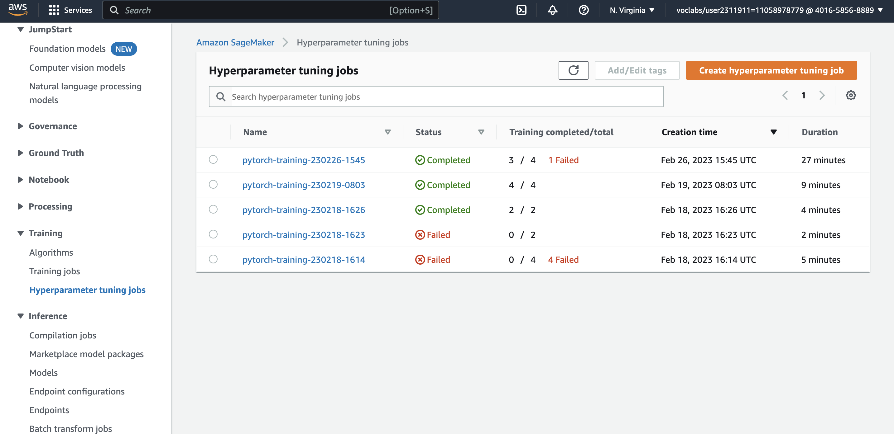
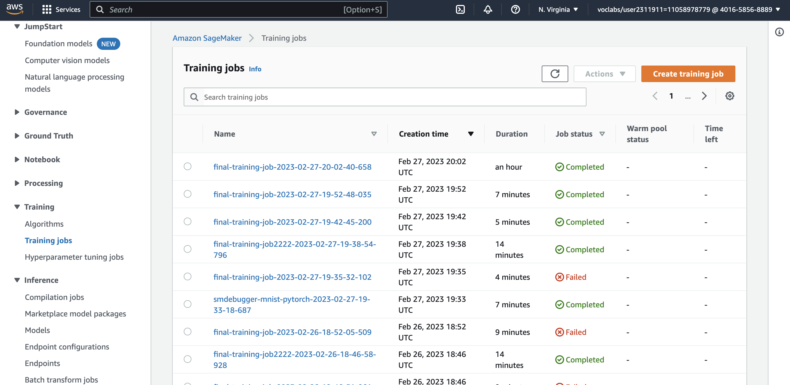
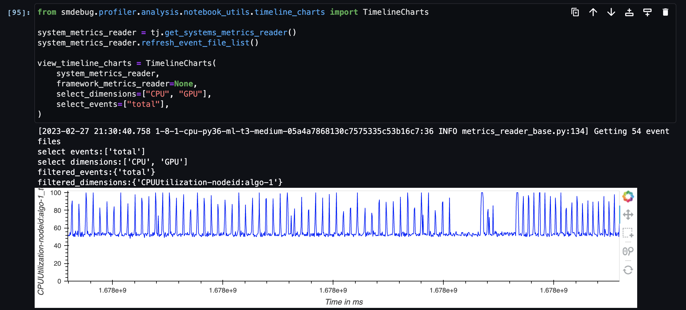
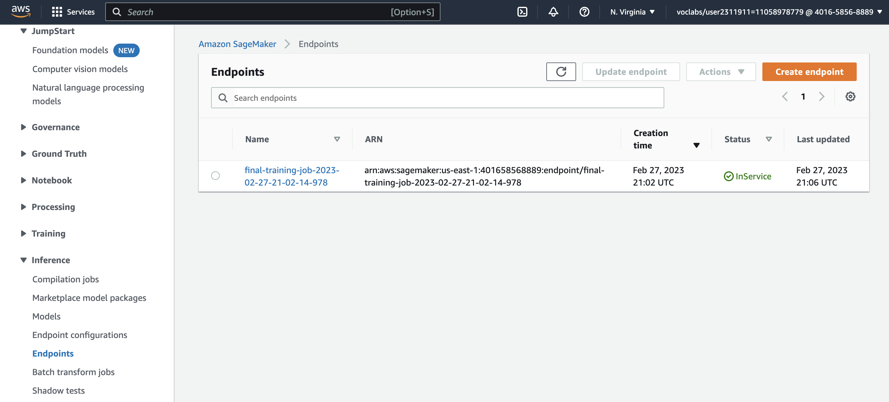

# Image Classification using AWS SageMaker

Use AWS Sagemaker to train a pretrained model that can perform image classification by using the Sagemaker profiling, debugger, hyperparameter tuning and other good ML engineering practices. In this project we use the dog breed classication dataset to classify between different breeds of dogs in images.


## Project Set Up and Installation
Enter AWS through the gateway in the course and open SageMaker Studio. 
Download the starter files.
Download/Make the dataset available. 

The project files can be found under the directory `project-files`:
* `train_and_deploy.ipynb`: Notebook used in sagemaker to perform the hyperparameter optimization, final model training, and model deployment.
* `hpo.py`: Script file used for hyperparameter optimization
* `train_model.py`: Script used for model training and deployment.

## Dataset
The provided dataset is the dogbreed classification dataset which can be found in the classroom.
The project is designed to be dataset independent so if there is a dataset that is more interesting or relevant to your work, you are welcome to use it to complete the project.

### Access
Upload the data to an S3 bucket through the AWS Gateway so that SageMaker has access to the data. 

## Model
For this experiment whe chose the **Resnet-50** (residual neural network). This is a variation of ResNet architecture with 50 deep layers that has been trained on at least one million images from the ImageNet database. The 50-layer ResNet uses a bottleneck design for the building block. A bottleneck residual block uses 1×1 convolutions, known as a “bottleneck”, which reduces the number of parameters and matrix multiplications. This enables much faster training of each layer.

Instead of random initialization, we initialize the network with the pretrained network: We freeze the weights for all of the network except that of the final fully connected layer. This last fully connected layer is replaced with a new one with random weights and only this layer is trained.

## Hyperparameter Tuning
For the hyperparameter tunning we chose two hyperparameters:
* The learning rate: Range beteen 0.001 and 0.1
* The batch size: Values 32, 64, and 128.

The following image, shows a screenshot of the hyperparameter tuning jobs in Sagemaker:


## Training jobs
The following image, shows a screenshot of completed training jobs in Sagemaker:


## Debugging and Profiling
For debugging and profiling the model we defined `rules`, `collection_configs`, `hook_config`, and `profiler_config`, which we passed to the Sagemaker estimator.

### Results
The profiler report can be found under the directory `ProfilerReport` inside the directory `project-files`.

The following image shows a screenshot of the CPU utilization during the training process:



## Model Deployment
The model was deployed using the method `deploy` of the Sagemaker estimator: 
```python
predictor = estimator.deploy(initial_instance_count=1, instance_type="ml.t2.medium")
```

The following image, shows a screenshot of the endpoint where the model is deployed:


To query the endpoint with a sample input, the following processing is needed:
```python
import torchvision.transforms as transforms

def process_image(image):    
    img = image.convert('RGB')
    data_transform = transforms.Compose(
        [transforms.Resize(256),
        transforms.CenterCrop(224),
        transforms.ToTensor(),
        transforms.Normalize([0.485, 0.456, 0.406], [0.229, 0.224, 0.225])]
    )

    return data_transform(img)[:3,:,:].unsqueeze(0).numpy()

img = Image.open("<path-to-image>")
img_processed = process_image(img)

response = predictor.predict(img_processed)
print("Prediction result (beed index): ", np.argmax(response[0]) + 1)
```


